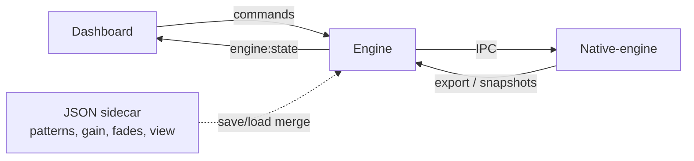

# TheStuu

TheStuu ist eine DAW-orientierte Musikproduktions-App mit Fokus auf:
- schnelle Arrangement-Bearbeitung im Edit-Flow,
- Track-/Node-/Mix-Workflows in einer UI,
- nativen Audio- und Plugin-Funktionen via C++ Backend (Tracktion/JUCE),
- erweiterbaren AI-gestuetzten Produktions-Features.

Die App ist als Monorepo aufgebaut und trennt klar zwischen UI, Orchestrierung und nativer Engine.

---

## Schnellstart (empfohlen)

```bash
npm install
bash scripts/setup-tracktion.sh   # einmalig: Tracktion/JUCE Vendor
export STUU_NATIVE_VENDOR_DIR="$(pwd)/vendor/tracktion_engine"
npm run dev
```

`npm run dev` (und `npm run start`) starten **alles zusammen** — mit Cleanup alter Prozesse auf `:3990` / `:3010` und festem Native-Socket `/tmp/thestuu-native.sock` (gleicher Pfad wie Tauri):

Das startet:
- **native-engine** (`thestuu-native`, Tracktion/JUCE)
- **Engine** (Node.js, Socket.IO auf `127.0.0.1:3990`)
- **Dashboard** (Next.js auf `http://127.0.0.1:3010`)

Der Browser oeffnet sich automatisch (ausser mit `--no-browser`).

| Was | URL / Pfad |
|-----|------------|
| Dashboard (UI) | http://127.0.0.1:3010 |
| Engine (HTTP health) | http://127.0.0.1:3990 |
| Projekte | `~/.thestuu/projects/` |
| Config | `~/.thestuu/config.json` |
| Native IPC Socket | `/tmp/thestuu-native.sock` (CLI, Engine, Tauri) |

**Desktop:** `npm run dev -- --desktop` oder `npm run desktop:dev`  
**Details:** `docs/dev.md`

**Standard-Modus:** `npm run dev` setzt **native-first** DAW-Flags. Fuer JSON-only QA: `npm run start -- --legacy-daw --no-browser`.

---

## Was laeuft wo?

```text
┌─────────────────────────────────────────────────────────────┐
│  Browser / Tauri Desktop  →  Dashboard (Next.js :3010)      │
│       │ Socket.IO (engine:state, transport, meter, …)       │
│       ▼                                                     │
│  Engine (Node :3990)  →  Router, JSON-Sidecar, VST-Scan    │
│       │ MessagePack IPC (Unix socket)                       │
│       ▼                                                     │
│  native-engine (thestuu-native)  →  Tracktion DAW truth     │
└─────────────────────────────────────────────────────────────┘
```

| Komponente | Ordner | Start einzeln |
|------------|--------|----------------|
| **CLI (voller Stack)** | `apps/cli` | `npm run dev` (Root) |
| **Dashboard** | `apps/dashboard` | `npm run dev --prefix apps/dashboard` |
| **Engine** | `apps/engine` | `npm run start --prefix apps/engine` |
| **Native** | `apps/native-engine` | `./apps/native-engine/build/thestuu-native` |
| **Desktop (Tauri)** | `apps/desktop` | `npm run desktop:dev` (= `npm run dev -- --desktop`) |

**Wichtig:** Fuer echte DAW-Funktion immer `npm run dev` (ein Befehl). Nur Dashboard ohne Engine/Native → **NO AUDIO** in der UI.

---

## CLI Optionen

```bash
npm run dev
npm run dev -- --desktop
npm run dev -- --reuse                 # stale Prozesse nicht killen (nur wenn DAW schon ready)
npm run start -- --no-browser
npm run start -- --legacy-daw
```

Hilfe: `node apps/cli/bin/thestuu.js --help`

---

## Performance & Smoothness (2026)

Fuer fluessige Bedienung auch auf schwacher Hardware wurde der Stack entkoppelt und gedrosselt. Details und Mess-Szenarien: **`docs/performance.md`**.

### Engine

- **Kein doppeltes Transport** mehr: Bei native-first kommt `engine:transport` von `transport.tick`, nicht zusaetzlich vom Meter-Timer.
- **Meter-Gating:** `transport.get_meters` nur wenn Clients verbunden sind und nicht alle `client:meter_pause` gesendet haben.
- **Meter-Intervall:** Default `STUU_METER_INTERVAL_MS=80` (via CLI). `STUU_PERF=low` → ~140 ms.

### Dashboard

- **`DawShell`** (`apps/dashboard/components/daw/daw-shell.jsx`) umschliesst die UI mit `MetersProvider`.
- **Meter-Store** (`apps/dashboard/lib/meter-store.js`): Pegel-Updates triggern nur Meter-Komponenten, nicht die ganze `stuu-shell.jsx`.
- **Ein globaler Meter-Animator** (`apps/dashboard/lib/meter-animator.js`) statt pro-`LevelMeter`-rAF.
- **Transport:** Playhead ueber Ref/CSS; `setTransport` waehrend Play nur bei BPM/Play/Record-Aenderung.
- **Sichtbarkeit:** Tab hidden oder nicht Edit/Mix → `client:meter_pause` (Engine spart IPC).
- **Virtualisierung:** Clips nur im sichtbaren Zeitbereich; Track-Rows >24 nur im Viewport.

### Einstellungen (UI)

**Settings → PERFORMANCE:** Low / Balanced / High (localStorage + Hinweis an Engine). Low = leichtere Meter, weniger UI-Last.

### Umgebungsvariablen (Performance)

| Variable | Wirkung |
|----------|---------|
| `STUU_METER_INTERVAL_MS` | Meter-Poll-Intervall der Engine (ms) |
| `STUU_PERF=low` | Langsamere Meter, leichteres UI-Profil |
| `STUU_METER_UI_FALLBACK=1` | Nur Tests: Fake-Meter wenn Native keine Pegel liefert |

### Produktions-Build (Benchmark)

`next dev` ist **nicht** der Massstab fuer FPS/CPU:

```bash
npm run build --prefix apps/dashboard
npm run start   # voller Stack; Dashboard dann ggf. separat next start
```

---

## Diagnostik & LOGS

In der Dashboard-Topbar: **logs** oeffnen.

- Health-Zeilen: Dashboard, Node-Engine, native-engine, IPC, Tracktion, Audio
- **Legacy-Warnung** wenn `clipOps=false` (nicht fuer smooth Playback optimiert)
- Engine-Log-Stream + optional Tauri-Desktop-Diagnostik

Weitere Infos: `docs/desktop-diagnostics.md`, `docs/desktop-tauri.md`

---

## Desktop shell (Tauri, optional)

Native-Fenster ohne separaten Browser:

```bash
# Terminal 1
npm run start

# Terminal 2
npm run desktop:dev
```

Details: `docs/desktop-tauri.md`

---

## DAW Authority (Native-first)

Tracktion/native ist **Single Source of Truth** fuer Arrangement, Transport, Mixer, Plugins und Undo — wenn die Native-Flags aktiv sind (Standard bei `npm run start`).



Vollstaendige Regeln: **`docs/daw-authority-guardrails.md`**

### Native-Flags (bei `npm run start` gesetzt)

| Flag | Rolle |
|------|------|
| `STUU_NATIVE_CLIP_OPS=1` | Clip move/resize/delete/import → native |
| `STUU_NATIVE_TRACK_OPS=1` | Track create/delete/reorder → native |
| `STUU_NATIVE_EDIT_UNDO=1` | Undo/Redo → native `edit.undo` / `edit.redo` |
| `STUU_NATIVE_PROJECT_SIDECAR=1` | Save/Load: native export + JSON-Metadaten |
| `STUU_NATIVE_LEGACY_SYNC=0` | Muss aus bleiben fuer native-first |
| `STUU_NATIVE_TRANSPORT=1` | Native Transport (Standard) |

**Legacy-Modus** (`--legacy-daw`): alle `STUU_NATIVE_*` Clip/Track-Flags aus — nur fuer `qa:legacy-daw` und Vergleichstests.

---

## QA & CI

| Check | Befehl | Wann |
|-------|--------|------|
| Static DAW guard | `npm run check:daw-authority` | PR / vor Commit |
| Unit tests (merge) | `npm run test:daw-authority` | PR |
| Native E2E (12 Punkte) | `npm run qa:native-daw` | Lokal nach Aenderungen an Engine/Native |
| Legacy smoke | `npm run qa:legacy-daw` | Mit `--legacy-daw` / ohne Native-Flags |

**Native E2E manuell** (wenn Stack nicht via CLI laeuft):

```bash
# Terminal 1 — native
export STUU_NATIVE_VENDOR_DIR="$(pwd)/vendor/tracktion_engine"
./apps/native-engine/build/thestuu-native

# Terminal 2 — engine mit Flags (wie npm run start)
cd apps/engine
export STUU_NATIVE_CLIP_OPS=1 STUU_NATIVE_EDIT_UNDO=1 STUU_NATIVE_TRACK_OPS=1
export STUU_NATIVE_PROJECT_SIDECAR=1 STUU_NATIVE_LEGACY_SYNC=0
export ENGINE_PORT=3990
node src/server.js

# Terminal 3 — QA
npm run qa:native-daw
```

GitHub Actions (`.github/workflows/daw-qa.yml`): `check:daw-authority` + `test:daw-authority` auf PR; `qa:legacy-daw` nightly auf main.

---

## Was ist integriert

### Produkt- und Laufzeitarchitektur

```
Dashboard (Next.js)  →  rendert bestätigten State
Engine (Node.js)     →  WebSocket/IPC-Router, Sidecar-Metadaten (Patterns/View)
Native (C++/Tracktion) →  Transport, Clips, Tracks, Mixer, Plugins, DAW-Undo
```

### Edit-Workflow (Arrangement)
- Import von Audio/MIDI-Clips, Timeline mit Grid und Playhead
- Clip Create/Move/Resize/Delete, Tools (Select/Delete/Slice/Slip/Zoom)
- Clip-Fades mit Kurven, Track-Management

### Transport und Timing
- Play, Pause, Stop, Seek, BPM, Taktart, Metronom
- Native `transport.tick` fuer konsistente Wiedergabe

### Mixer und Plugins
- Volume, Pan, Mute, Solo, Record-Arm, FX-Chains
- VST-Scan/Laden, Plugin-Editor, Tracktion-Core-Plugins

### Persistenz
- Projekte unter `~/.thestuu/projects`, Default `welcome.stu`
- Undo/Redo (native wenn Flags aktiv)

---

## Repo-Struktur

```text
/apps
  /cli              Start-CLI (npm run start)
  /dashboard        Next.js UI
    /app            Next App Router (page → DawShell)
    /components
      stuu-shell.jsx       Haupt-DAW-UI (Edit / Mix / Node)
      connection-status-logs.jsx   LOGS + Health
      /daw            Performance-Module (Shell, Meter-UI, Subscription)
    /context          React Provider (z. B. MetersProvider)
    /lib              meter-store, meter-animator, clip-visibility, socket, …
  /engine           Node Engine + Socket.IO + Native Bridge
  /native-engine    C++ (thestuu-native)
  /desktop          Tauri Desktop Shell
/packages
  /shared-json      .stu Schema
  /protocol         Socket-Event-Namen (ENGINE_EVENTS, CLIENT_EVENTS)
/docs
  performance.md              Performance-Messung & Zielmetriken
  daw-authority-guardrails.md   Native vs JSON Regeln
  native-ipc.md                 IPC-Protokoll
  desktop-diagnostics.md        LOGS / Tauri Diagnostik
  desktop-tauri.md              Desktop-App
  styleguide-ui.md              UI-Konventionen
/scripts
  qa-native-daw.mjs             Automatisierte Native QA
  check-daw-authority.sh        Statischer Guard
```

---

## Einzelkomponenten entwickeln

### Nur Dashboard (Frontend)

```bash
npm run dev --prefix apps/dashboard
# http://127.0.0.1:3010 — braucht laufende Engine auf :3990 fuer volle Funktion
```

Dev nutzt `next dev --webpack` (stabiler als Turbopack bei diesem Projekt).

### Nur Engine

```bash
npm run start --prefix apps/engine
# Setze dieselben STUU_NATIVE_* Variablen wie die CLI, wenn Native laeuft
```

### Native neu bauen

```bash
cd apps/native-engine
cmake -B build -DSTUU_ENABLE_TRACKTION=ON
cmake --build build
```

Siehe auch `apps/native-engine/README.md` und `docs/tracktion-setup.md`.

---

## Bedienung (Kurz)

1. **`npm run start`** — Browser oeffnet Dashboard.
2. **Edit-Tab:** Clips importieren, auf Grid ziehen, Tools nutzen.
3. **Transport:** BPM, Play/Pause/Stop, Metronom.
4. **Mix-Tab:** Fader, Pan, Mute/Solo, FX-Slots, VST.
5. **Settings:** Audio-Geraete, VST-Plugins, **Performance-Profil**.
6. **LOGS (Topbar):** Verbindung und Native-Health pruefen.

---

## Konzept & Roadmap

Geplante Features (Konzepte in `docs/`):

- Sync Button — `docs/sync button.md`
- Analyze BPM/Key — `docs/analyze-bpm-key.md`
- Extract Stems — `docs/extract-stems.md`
- Fit To Tempo — `docs/fit-to-tempo.md`
- Node/Mixer im Edit — `docs/node-mixer-konzept-fuer-edit-tab.md`
- Plugin-UI — `docs/plugin-ui-recherche-und-konzept.md`

---

## Troubleshooting

| Problem | Massnahme |
|---------|-----------|
| Kein Audio / Transport tot | LOGS pruefen; `npm run start` (nicht nur Dashboard). Native-Prozess laeuft? |
| Tracktion grau in LOGS | `thestuu-native` neu bauen; Vendor-Pfad `STUU_NATIVE_VENDOR_DIR` |
| Legacy-Warnung in LOGS | Mit `npm run start` starten, nicht `--legacy-daw` |
| UI ruckelt | Settings → PERFORMANCE → Low; Prod-Build testen (`docs/performance.md`) |
| Meter bleiben bei 0 | Native `transport.get_meters`; `thestuu-native` rebuild |
| Vendor fehlt | `bash scripts/setup-tracktion.sh` oder `STUU_NATIVE_VENDOR_DIR` setzen |

Logs: **LOGS-Panel** in der UI + Terminal-Ausgabe von `npm run start`.
