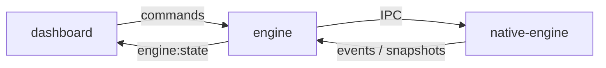

# Architecture: DAW state authority

This document is the canonical reference for how TheStuu splits responsibility between the dashboard, Node orchestrator, and native Tracktion engine. Coding agents and contributors must follow it for any DAW-related change.

Related: `AGENTS.md` (short rules), `.cursor/rules/daw-state-authority.mdc` (always-on in Cursor), **`docs/daw-authority-guardrails.md`** (enforcement + allowed fields), `docs/native-ipc.md` (IPC command list), **`docs/refactor-plan-daw-authority.md`** (sprint plan and tasks).

## Goal

**Tracktion (`apps/native-engine`) is the single source of truth for all DAW state.**

Node must stop acting as a DAW engine. It becomes a thin API/WebSocket/IPC router plus app orchestrator. The dashboard renders state that native-engine has confirmed.

### Why

A DAW needs one authoritative owner of the edit graph. Tracktion already owns the real audio timeline, playback, tracks, clips, plugins, mixer, and transport. If Node also owns and mutates those domains, the project can drift: UI shows one thing, Node believes another, Tracktion plays a third.

### What we keep

| Layer | Role |
|-------|------|
| `apps/dashboard` | Next.js UI |
| `apps/engine` | Node API, WebSocket, IPC to native, AI/cloud/metadata |
| `apps/native-engine` | C++/JUCE/Tracktion DAW engine |
| Current CLI/dev startup | Unchanged unless strictly required |

## Layer responsibilities



### Native-engine owns (authoritative)

- Tracks, clips, playlist/timeline layout in the edit
- Transport (play, stop, seek, tempo)
- Mixer (volume, pan, mute, solo, record arm)
- Plugins (load, unload, parameters)
- Automation and routing (as implemented in Tracktion)
- DAW undo/redo
- DAW project save/load (audio/MIDI references, edit graph)

### Node may own

- HTTP/WebSocket API
- IPC connection and process management
- AI features, cloud/user features
- Project **metadata** (title, cloud ID, tags, thumbnails, AI notes)
- File browsing and import **preparation** (paths, validation before native import)
- Plugin catalog cache
- **Read-only** `lastNativeSnapshot` from the last native snapshot/event
- Logs, status, error handling

### Node must NOT own or mutate (target state)

- `state.project.playlist` as writable DAW truth
- Clip create/move/resize/delete in JSON before native confirms
- Transport truth independent of native ticks
- `projectHistory` undo/redo stacks for DAW edits
- Mixer/plugin state as source of truth

### Dashboard

- Treats native snapshots and events as authoritative
- May use optimistic UI while dragging (e.g. `clipDrafts`)
- **Must reconcile** to native-confirmed state after command response or `edit.snapshot` / domain events

## Current state (legacy, being migrated)

Today `apps/engine/src/server.js` still mutates `state.project` (playlist, clips, mixer) and then pushes to native via patterns such as:

- `syncNativeArrangementFromPlaylist` → `edit:clear-audio-clips` → re-import all clips
- `projectHistory` for undo/redo over JSON snapshots
- Transport fallback that starts a JS playhead when native play fails

**Do not extend these patterns for new features.** Migrate feature-by-feature to native-first commands.

### Native commands already implemented (IPC v1+)

See `docs/native-ipc.md` and `apps/native-engine/src/main.cpp` for the live list. Examples:

- Transport: `transport.play`, `transport.pause`, `transport.seek`, `transport.set_bpm`, …
- Edit: `edit:get-audio-clips`, `edit:clear-audio-clips`, `clip:import-file`
- Tracks: `track:set-mute`, `track:set-solo`, `track:set-volume`, `track:set-pan`, `track:set-record-arm`
- VST: `vst:scan`, `vst:load`, `vst:param:set`

**Not yet native-first (target work):** `clip.move`, `clip.resize`, `clip.delete`, `track.create`, `edit.undo`, full `edit.save` / `edit.open`, etc.

## Required workflow for every DAW change

1. **Protocol** — Add or extend command/event in `packages/protocol` (preferred) or `docs/native-ipc.md`.
2. **Native** — Implement in `apps/native-engine`; apply change in Tracktion; return snapshot or emit event.
3. **Node** — Forward command; update read-only cache from response/event only.
4. **Dashboard** — Send command via existing socket API; render reconciled state.

### DO / DON'T (Node)

```javascript
// DON'T — new feature
clip.start = nextStart;
await syncNativeArrangementFromPlaylist();

// DO — target
await requestNativeTransport('clip.move', { track_id, clip_id, start });
// then apply payload from native edit.snapshot / clip.changed to cache only
```

```javascript
// DON'T — fake DAW when native is down
state.playing = true;
transportClock.start();

// DO
emitEngineOffline();
disableDawControls();
```

## Migration plan (incremental)

Do **not** rewrite the whole app in one pass. Order:

| Step | Area | Target |
|------|------|--------|
| 1 | Protocol | `packages/protocol` — shared commands/events |
| 2 | Audit | Classify `server.js` uses: metadata / read-only cache / illegal mutation |
| 3 | Transport | Native authoritative; remove JS playhead fallback |
| 4 | Clips | `clip.move`, `clip.resize`, `clip.delete`, `clip.import` via native |
| 5 | Tracks | `track.create`, `track.delete`, `track.rename`, reorder |
| 6 | Mixer & plugins | All mixer/plugin changes via native only |
| 7 | Undo/redo | `edit.undo` / `edit.redo` in native; deprecate `projectHistory` for DAW |
| 8 | Save/load | Tracktion project on native; Node stores metadata sidecar |
| 9 | Cache | `lastNativeSnapshot` read-only only |
| 10 | Dashboard | Reconcile after every mutation |
| 11 | Offline | Explicit engine-offline UI; no silent fake projects |
| 12 | Startup | Keep current dev flow; optional single CLI later |

### Protocol sketch (target)

**Commands (examples):** `transport.play`, `transport.stop`, `transport.seek`, `transport.setTempo`, `edit.create`, `edit.open`, `edit.save`, `edit.undo`, `edit.redo`, `track.create`, `track.delete`, `track.rename`, `clip.import`, `clip.move`, `clip.resize`, `clip.delete`, `clip.split`, `clip.setFade`, `mixer.setVolume`, `mixer.setPan`, `mixer.setMute`, `mixer.setSolo`, `mixer.setRecordArm`, `plugin.scan`, `plugin.load`, `plugin.unload`, `plugin.setParameter`

**Events (examples):** `engine.ready`, `engine.offline`, `engine.error`, `transport.changed`, `edit.snapshot`, `edit.saved`, `edit.loaded`, `track.changed`, `clip.changed`, `mixer.changed`, `plugin.changed`, `command.failed`

Align naming with existing socket events (`transport:play`) via adapters until a single canonical naming scheme is chosen.

### Out of scope for “native owns everything” (for now)

Clarify per task; typical Node/UI-owned data:

- **Song structure lane** (section markers) — may stay app metadata until native models it
- **Pattern sequencer data** — MIDI/pattern clips may need a separate migration track from audio clips
- **Chat, settings, cloud** — always Node/app

Document the decision when adding features in these areas.

## Engine offline

If `native-engine` is not running:

- Show explicit offline state in the UI
- Disable real DAW controls (transport, clip edit, mixer, record)
- Do not mutate or invent `state.project` playlist/clips to “keep the UI alive”
- Non-DAW UI (settings, chat, docs) may remain available

## Acceptance criteria (migration complete)

- [ ] Next.js, Node, and native-engine still run with existing dev startup
- [ ] DAW controls work after migration per domain
- [ ] Transport state comes from native-engine events/snapshots
- [ ] Clip changes are applied in Tracktion first; UI matches native snapshot
- [ ] Track changes are native commands
- [ ] Mixer/plugin changes are native commands
- [ ] Node does not mutate DAW project state directly for new code
- [ ] Node-side DAW `projectHistory` is removed or deprecated
- [ ] Native-engine can return an authoritative `edit.snapshot`
- [ ] UI reconciles optimistic edits to native-confirmed state
- [ ] Engine offline is visible; no fake DAW state

## Audit checklist (Step 2)

Search `apps/engine/src/server.js` for:

- `state.project`, `state.transport`, `state.playing`
- `projectHistory`, `playlist`, `clips`, `mixer`, `plugins`
- `nativeClipSyncSummary`, `syncNativeArrangementFromPlaylist`
- `saveProject`, `loadProject`, `reorderTrack`, `reindexTracks`

Classify each hit:

| Class | Action |
|-------|--------|
| A — App metadata | Keep in Node |
| B — Read-only native cache | Keep; only update from native |
| C — Illegal DAW mutation | Migrate behind native command |

## Enforcement (guardrails)

| Mechanism | Location |
|-----------|----------|
| Canonical field lists + dev assertions | `apps/engine/src/daw-authority.js` |
| CI pattern guard | `scripts/check-daw-authority.sh` → `npm run check:daw-authority` |
| Unit tests (merge / assertions) | `apps/engine/test/daw-authority.test.js` → `npm run test:daw-authority` |
| Native-first QA | `scripts/qa-native-daw.mjs` → `npm run qa:native-daw` |

See **`docs/daw-authority-guardrails.md`** for the architecture diagram, JSON-only fields, and contributor checklist.

## References

- `packages/shared-json` — project JSON schema / normalization (not command transport)
- `docs/daw-authority-guardrails.md` — enforcement rules and allowed JSON-only fields
- `docs/native-ipc.md` — IPC framing and command list (keep in sync with native)
- `apps/engine/src/server.js` — current orchestrator (legacy mutations here)
- `apps/engine/src/daw-authority.js` — runtime + exported constants
- `apps/native-engine/src/main.cpp` — command dispatch
