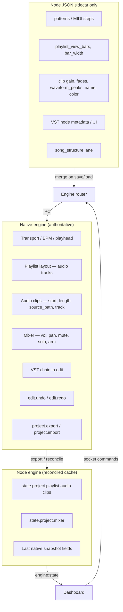

# DAW authority guardrails

Canonical enforcement reference for contributors and coding agents. Prevents rebuilding a second DAW inside Node.

**Also read:** `docs/architecture-state-authority.md` (architecture), `.cursor/rules/daw-state-authority.mdc` (Cursor), `AGENTS.md` (short rules).

## Authority model



## Rules (must follow)

| Rule | Enforcement |
|------|-------------|
| Audio arrangement changes go to native first when `STUU_NATIVE_CLIP_OPS=1` | `assertLegacyJsonArrangementAllowed`, QA `qa:native-daw` |
| Track layout changes go to native first when `STUU_NATIVE_TRACK_OPS=1` | Same |
| Update Node cache only from native export / `edit:get-audio-clips` / reconcile helpers | `runDuringNativeReconcile` |
| No `projectHistory` DAW undo when native undo flags on | `assertJsonProjectHistoryAllowed`, `check-daw-authority` |
| No new `syncNativeArrangementFromPlaylist` outside legacy hub | `check-daw-authority` |
| Dev: no direct `clip.start` / `clip.length` writes when native authority on | `assertDirectArrangementMutationAllowed` |

## Allowed JSON-only fields

### Audio clip (sidecar / UI)

`gain`, `fade_in`, `fade_out`, `fade_in_curve`, `fade_out_curve`, `waveform_peaks`, `source_duration_seconds`, `trim_start_seconds`, `name`, `color`, `source_name`, `source_format`, `id` (stable id preserved across merge; placement still from native).

### Track (UI / patterns)

`chain_collapsed`, `chain_enabled`, pattern clips in `clips[]` (non-audio). Audio clip **arrangement** fields inside `clips[]` are native-owned when clip ops flag is on.

### Project (app metadata)

`project_name`, `patterns`, `nodes`, `song_structure`, `playlist_view_bars`, `playlist_bar_width`, `playlist_show_track_nodes`.

## Native-authoritative fields

### Audio clip arrangement

`start`, `length`, `source_path`, track placement (which `track_id` holds the clip).

### Track arrangement

`track_id`, order (via native reorder), `name` (when synced from native list).

### Mixer

`volume`, `pan`, `mute`, `solo`, `record_armed` per track; master volume/pan from native export.

## Code locations

| File | Role |
|------|------|
| `apps/engine/src/daw-authority.js` | Constants, assertions, reconcile guard |
| `apps/engine/src/authoritative-merge.js` | Save/load sidecar merge (native + JSON) |
| `apps/engine/src/server.js` | Legacy hub — allowlisted until fully migrated |
| `scripts/check-daw-authority.sh` | CI ripgrep guard for dangerous patterns |

## Environment flags

| Variable | Effect |
|----------|--------|
| `STUU_NATIVE_CLIP_OPS=1` | Native owns audio clip arrangement |
| `STUU_NATIVE_TRACK_OPS=1` | Native owns track layout |
| `STUU_NATIVE_EDIT_UNDO=1` | Native undo; no JSON `projectHistory` for DAW |
| `STUU_NATIVE_PROJECT_SIDECAR=1` | Save/load merges native export with JSON |
| `STUU_NATIVE_LEGACY_SYNC=0` | Required for native-first QA (no clear+reimport) |
| `DAW_AUTHORITY_STRICT=0` | Disable runtime direct-mutation assertions (not for CI) |
| `DAW_AUTHORITY_STRICT=1` | Force assertions even in production (debug) |

## Checks (local / CI)

```bash
npm run check:daw-authority
npm run test:daw-authority
npm run qa:native-daw   # requires engine + native with flags
```

## Adding a new DAW feature

1. Extend `packages/protocol` / `docs/native-ipc.md`.
2. Implement in `apps/native-engine`.
3. In `server.js`: native command → `runDuringNativeReconcile` / merge → `emitState`.
4. Do **not** assign `clip.start` / `clip.length` before native success.
5. Run `check:daw-authority` and `test:daw-authority`.
