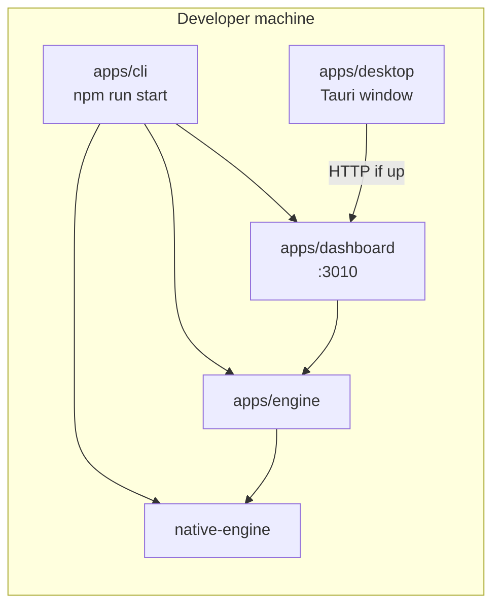

# TheStuu desktop shell (Tauri)

Tauri is a **desktop window and OS integration layer only**. It does not own, mutate, or reconcile DAW state.

| Layer | Role |
|-------|------|
| `apps/native-engine` | **DAW truth** (Tracktion) — clips, tracks, transport, mixer, undo |
| `apps/engine` | Node router + JSON sidecar (patterns, view, metadata) |
| `apps/dashboard` | Next.js UI |
| `apps/cli` | Dev/start workflow (`npm run start`) |
| `apps/desktop` | **Tauri shell** — native window, future process manager |

See also: `docs/daw-authority-guardrails.md`, `docs/architecture-state-authority.md`.

## Architecture (phase 1)



**Tauri never sits in the DAW data path.** It only loads the dashboard URL when the stack is already running.

## Current dev flow (phase 1)

1. Terminal A — start TheStuu as today:

   ```bash
   npm run start
   ```

   This uses `apps/cli` and starts native-engine, engine, and dashboard (port **3010**).

2. Terminal B — open the desktop shell:

   ```bash
   npm run desktop:dev
   ```

3. Behaviour:
   - Rust probes `127.0.0.1:3010` (or `THESTUU_DASHBOARD_URL`).
   - If reachable → webview navigates to `http://127.0.0.1:3010`.
   - If not → bundled `apps/desktop/offline/index.html` with retry UI.

`npm run start` is unchanged. `apps/cli` is not removed.

## Scripts

| Command | Description |
|---------|-------------|
| `npm run desktop:dev` | `tauri dev` in `apps/desktop` |
| `npm run desktop:build` | `tauri build` (release bundle; phase 1 still expects external stack or future sidecars) |

Optional env:

| Variable | Default | Purpose |
|----------|---------|---------|
| `THESTUU_DASHBOARD_URL` | `http://127.0.0.1:3010` | Dashboard URL for shell navigation |

## Future packaged desktop flow (not implemented)

Planned sidecars (Tauri **spawns and supervises**, does not implement DAW logic):

| Sidecar | Binary / process | Responsibility |
|---------|------------------|----------------|
| Native | `thestuu-native` | Tracktion DAW — arrangement, transport, mixer, plugins |
| Engine | `node apps/engine/src/server.js` | WebSocket API, sidecar merge, IPC to native |
| Dashboard | static server or embedded Next export | UI assets served to the webview |

Target startup order: native → engine → dashboard → Tauri window.

Tauri responsibilities later:

- Spawn/kill/restart sidecars
- Health checks and crash recovery
- OS menus, file associations, auto-update (platform-specific)
- Single `.app` / `.exe` installer

**Out of scope for the shell:** clip move, undo stacks, mixer state, project JSON as source of truth.

## Per-platform build notes

### macOS

- Install [Rust](https://rustup.rs/) and Xcode command line tools.
- `npm run desktop:build` → `.app` under `apps/desktop/src-tauri/target/release/bundle/`.
- Code signing / notarization: not configured in this scaffold.

### Windows

- Rust + Visual Studio Build Tools (MSVC).
- WebView2 runtime (usually present on Windows 10+).

### Linux

- Rust + system deps (`webkit2gtk`, etc. — see [Tauri prerequisites](https://v2.tauri.app/start/prerequisites/)).
- `.deb` / `.AppImage` from `tauri build` when bundle targets are enabled.

## What this task did **not** do

- Bundle native-engine, engine, or dashboard into the Tauri app
- Change DAW authority rules or native-first flags
- Replace `npm run start` or remove `apps/cli`
- Add product features (menus, project open dialogs, auto-update)
- Ship production installers with signed sidecars

## QA

After desktop changes, run:

```bash
npm run check:daw-authority
npm run test:daw-authority
```

With engine + native running and native flags set:

```bash
npm run qa:native-daw
```

Legacy smoke requires engine **without** `STUU_NATIVE_*=1`:

```bash
npm run qa:legacy-daw
```

Desktop scaffold does not affect these checks unless engine/native code was modified.

## Repository layout

```
apps/desktop/
  offline/index.html      # offline / retry UI (not DAW UI)
  src-tauri/              # Rust + Tauri config
  package.json
```

Do not commit: `src-tauri/target/`, `node_modules/`, `vendor/`, native build artifacts.
