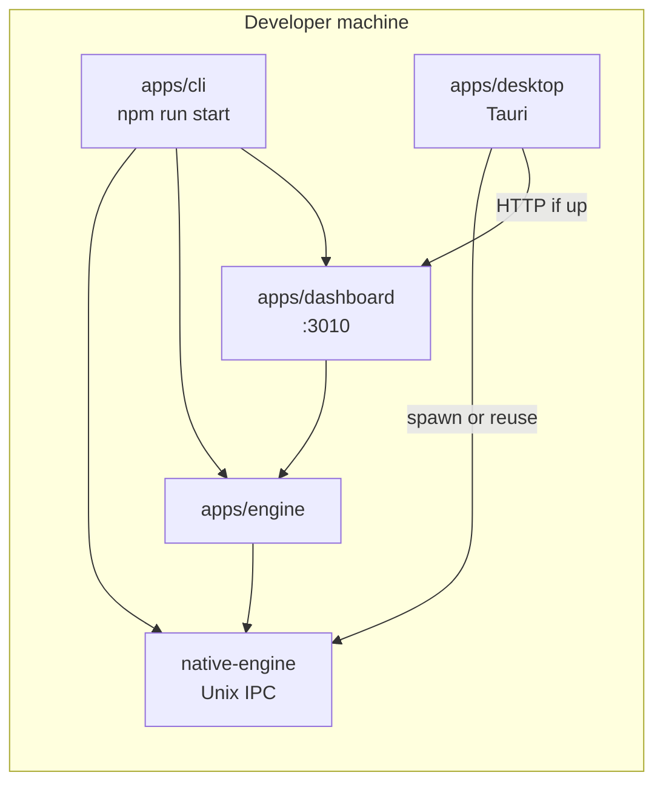

# TheStuu desktop shell (Tauri)

Tauri is a **desktop window and OS integration layer only**. It does not own, mutate, or reconcile DAW state.

| Layer | Role |
|-------|------|
| `apps/native-engine` | **DAW truth** (Tracktion) — clips, tracks, transport, mixer, undo |
| `apps/engine` | Node router + JSON sidecar (patterns, view, metadata) |
| `apps/dashboard` | Next.js UI |
| `apps/cli` | Dev/start workflow (`npm run start`) |
| `apps/desktop` | **Tauri shell** — window, native-engine lifecycle, future OS integration |

See also: `docs/daw-authority-guardrails.md`, `docs/architecture-state-authority.md`.

## Architecture (phase 2 — native sidecar)



**Tauri never sits in the DAW data path.** It may spawn `thestuu-native` and probe IPC health; it does not implement clip/track/project logic.

## Status model (shell UI)

The bundled shell page (`apps/desktop/offline/index.html`) distinguishes:

| Indicator | Meaning |
|-----------|---------|
| **UI online** | Dashboard HTTP reachable (`127.0.0.1:3010` or `THESTUU_DASHBOARD_URL`) |
| **native-engine process** | Unix socket accepting connections (spawned by Tauri or reused from `npm run start`) |
| **IPC connected** | `health.ping` → `{ pong: true }` over native MessagePack IPC |
| **Tracktion backend ready** | `backend.info` → `{ tracktion: true }` |
| **Audio device ready** | `audio.get_outputs` returns devices or a current output id |
| **DAW ready** | IPC + Tracktion + audio (native truth path usable) |

If native-engine fails to start, the shell shows an error and **Retry native-engine** — it does not fake DAW state.

## Current dev flow

### Full stack (unchanged)

```bash
npm run start
```

Starts native-engine, Node engine, and dashboard via `apps/cli`.

### Desktop shell

**Option A — desktop manages native-engine only** (Node/dashboard still manual):

```bash
# Build native binary once (CMake)
# apps/native-engine/build/thestuu-native

npm run desktop:dev
```

Tauri spawns `thestuu-native` on startup and stops it on exit **when it launched the process**.

**Option B — stack already running** (`npm run start` in another terminal):

```bash
npm run desktop:dev
```

Tauri **reuses** an existing native socket (env `STUU_NATIVE_SOCKET`, `/tmp/thestuu-native.sock`, or `thestuu-native-*.sock` in the temp dir). It does **not** kill a reused process on exit.

### Scripts

| Command | Description |
|---------|-------------|
| `npm run start` | CLI: native + engine + dashboard (unchanged) |
| `npm run desktop:dev` | Tauri dev window + native sidecar lifecycle |
| `npm run desktop:build` | Tauri release bundle (native binary must exist for sidecar) |

### Environment

| Variable | Default | Purpose |
|----------|---------|---------|
| `THESTUU_DASHBOARD_URL` | `http://127.0.0.1:3010` | Dashboard URL for webview navigation |
| `STUU_NATIVE_SOCKET` | `/tmp/thestuu-native.sock` | Unix socket for native IPC (match CLI when reusing) |
| `STUU_NATIVE_BIN` / `THESTUU_NATIVE_BIN` | *(auto)* | Override path to `thestuu-native` |
| `THESTUU_REPO_ROOT` | *(auto from crate path)* | Repo root for spawn `cwd` |

## Native-engine sidecar (Tauri `externalBin`)

Configured in `apps/desktop/src-tauri/tauri.conf.json`:

```json
"externalBin": ["../../native-engine/build/thestuu-native"]
```

Tauri expects a target-triplet suffix at build time, e.g.:

| Platform | Sidecar filename (examples) |
|----------|-------------------------------|
| macOS Apple Silicon | `thestuu-native-aarch64-apple-darwin` |
| macOS Intel | `thestuu-native-x86_64-apple-darwin` |
| Linux x86_64 | `thestuu-native-x86_64-unknown-linux-gnu` |
| Windows | `thestuu-native-x86_64-pc-windows-msvc.exe` |

`apps/desktop/src-tauri/build.rs` copies `apps/native-engine/build/thestuu-native` (or `Release/`) to the suffixed name when present.

**Dev binary paths (CMake, not committed):**

- `apps/native-engine/build/thestuu-native`
- `apps/native-engine/build/Release/thestuu-native` (MSVC / multi-config)

Rust spawn API: `app.shell().sidecar("thestuu-native")` with args `--socket <path>`.

## Future packaged desktop flow (not implemented)

| Sidecar | Status | Notes |
|---------|--------|-------|
| Native | **Phase 2** — spawn/stop in dev | Production bundling + signing not done |
| Engine (Node) | Planned | `node apps/engine/src/server.js` |
| Dashboard | Planned | static export or embedded server |

Target order when complete: native → engine → dashboard → Tauri window.

**Out of scope:** auto-update, code signing, shipping Tracktion/JUCE in git, Node sidecar in this task.

## Per-platform build notes

### macOS

- Build native: CMake target `thestuu-native` under `apps/native-engine/build/`.
- `npm run desktop:build` → `.app` under `src-tauri/target/release/bundle/`.
- Notarization / signing: not configured.

### Windows

- Binary: `thestuu-native.exe` in `build/` or `build/Release/`.
- Native IPC uses Unix domain sockets in current code — validate Windows support before shipping.

### Linux

- Rust + `webkit2gtk` (Tauri prerequisites).
- Sidecar: `thestuu-native-x86_64-unknown-linux-gnu` (or arm64 triple).

## Diagnostics UI

Integrated diagnostics panel: **`docs/desktop-diagnostics.md`**

- Open via **Diagnostics** button on shell home or **⌘⇧D**
- Log viewer, status grid, export/copy bundle
- No DAW control actions

## Tauri commands (shell ↔ UI)

| Command | Purpose |
|---------|---------|
| `get_desktop_diagnostics` | Full diagnostics (dashboard, engine, native, flags) |
| `get_diagnostic_logs` | Structured log entries |
| `get_desktop_status` | Legacy status subset |
| `export_diagnostics_bundle` | JSON export for support |
| `retry_native_startup` / `restart_native_engine` | Native sidecar lifecycle |

Events: `desktop://status`, `desktop://diagnostics` (polled every ~2s).

## QA

```bash
npm run check:daw-authority
npm run test:daw-authority
```

Native QA (engine on `:3990` with native flags):

```bash
STUU_NATIVE_CLIP_OPS=1 STUU_NATIVE_EDIT_UNDO=1 STUU_NATIVE_TRACK_OPS=1 \
STUU_NATIVE_PROJECT_SIDECAR=1 STUU_NATIVE_LEGACY_SYNC=0 npm run qa:native-daw
```

Legacy smoke requires engine **without** `STUU_NATIVE_*=1`:

```bash
npm run qa:legacy-daw
```

If legacy fails with *"engine has native-first flags enabled"*, restart the engine without native env vars — not a desktop regression.

Desktop changes do not modify `apps/engine` DAW authority paths.

## Repository layout

```
apps/desktop/
  offline/index.html       # shell status + retry (not DAW UI)
  src-tauri/
    src/lib.rs             # Tauri app + status poller
    src/native_sidecar.rs  # spawn / reuse / stop native-engine
    src/native_health.rs   # IPC health probes (read-only)
    build.rs               # copy native bin for externalBin triple
  package.json
```

Do not commit: `src-tauri/target/`, `node_modules/`, `vendor/`, native build artifacts.
